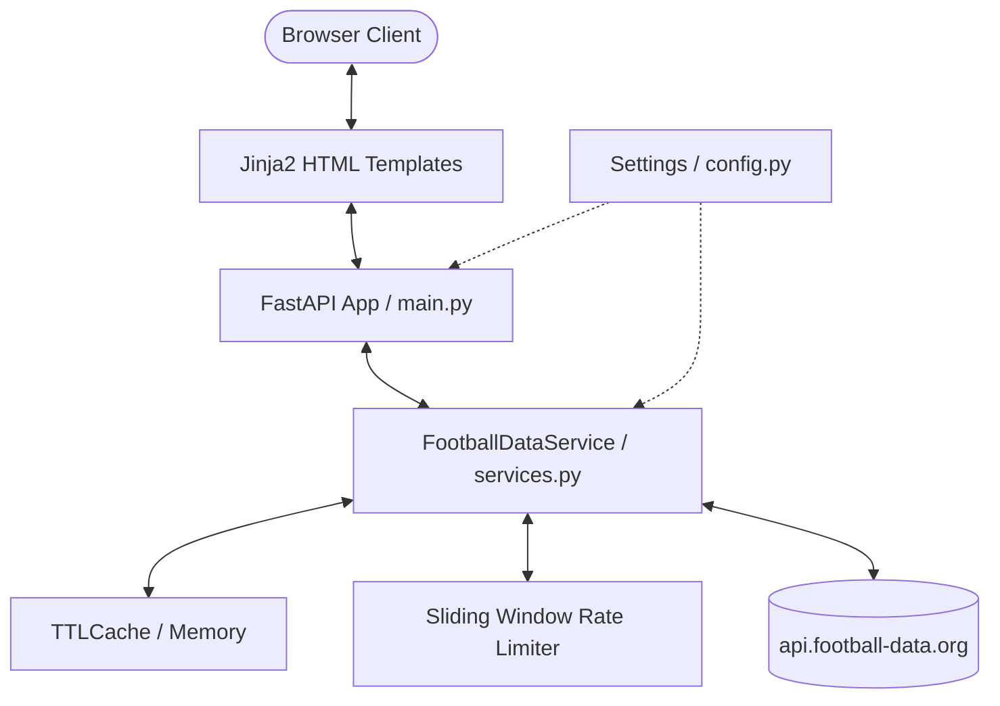

# ⚽ Football Zone

Football Zone is a sleek, modern web application designed for football enthusiasts who want to track league standings, fixtures, results, and AI-powered performance insights. Built with **FastAPI** on the backend and structured with clean architecture principles, it integrates with external football APIs to deliver high-fidelity data with sub-second response times.

---

## 🌟 Features

- **🏆 League Explorer:** Select and browse the top football leagues (Premier League, La Liga, Bundesliga, Serie A, Ligue 1, and more).
- **📊 Standings & Fixtures:** Interactive, beautifully structured league tables, latest results, and upcoming schedules.
- **🛡️ Team Deep Dives:** Detailed squad lists, mini-standings, and match history for specific clubs.
- **🚀 Advanced Caching & Rate Limiting:** Customized caching layer and sliding-window rate limiter ensuring reliable operation within external API constraints.
- **🤖 AI Analysis (Roadmap):** Machine learning integration to generate tactical insights and match predictions.

---

## ⚙️ Installation & Setup

### Prerequisites
- Python 3.10 or higher
- API token from [football-data.org](https://www.football-data.org/)

### 1. Clone the Repository
```bash
git clone https://github.com/MrSaral/football-zone.git
cd football-zone
```

### 2. Set Up Virtual Environment
Create and activate a virtual environment:

**On macOS/Linux:**
```bash
python -m venv .venv
source .venv/bin/activate
```

**On Windows (Command Prompt):**
```cmd
python -m venv .venv
.venv\Scripts\activate
```

**On Windows (PowerShell):**
```powershell
python -m venv .venv
.venv\Scripts\Activate.ps1
```

### 3. Install Dependencies
```bash
pip install --upgrade pip
pip install -r requirements.txt
```

### 4. Environment Configuration
Create a `.env` file in the root directory:
```env
FOOTBALL_API_KEY=your_api_key_here
```
*(Replace `your_api_key_here` with your actual token from football-data.org)*

---

## 🚀 Running the Application

Start the development server with hot-reload enabled:
```bash
uvicorn main:app --reload
```

The application will be accessible at:
- **UI Portal:** [http://127.0.0.1:8000/](http://127.0.0.1:8000/)
- **API Docs (Swagger):** [http://127.0.0.1:8000/docs](http://127.0.0.1:8000/docs)

---

## 🏗️ High-Level Architecture & Design

Football Zone is designed with a **clean, decoupled architecture** separating HTTP/routing layers, service abstractions, configuration, and UI templates.



### Key Components

1. **FastAPI Web Framework (`main.py`):** Acts as the controller. Serves responsive Jinja2 HTML templates and exposes JSON APIs for client-side consumption.
2. **Football Data Service (`services.py`):** Encapsulates external API communication.
   - **Sliding-Window Rate Limiter:** Protects against HTTP `429 Too Many Requests` by queuing requests dynamically when approaching the external limit (max 9 calls/minute).
   - **TTL Caching:** Uses `cachetools` to temporarily store responses (default TTL 10 minutes) for instant repeat reads and reduced network load.
3. **Configuration & Validation (`config.py`):** Uses Pydantic settings for robust environment variable validation and safe secret handling via `.env` files.

---

## 🛠️ Tech Stack

- **Backend:** FastAPI, Uvicorn (ASGI server), HTTPX (asynchronous requests)
- **Frontend:** Semantic HTML5, Vanilla CSS3 (Glassmorphism, custom layouts), Jinja2 templates
- **Caching & Utility:** Cachetools, Pydantic v2
- **Testing:** Pytest, Pytest-asyncio, Pytest-mock

---

## 🧪 Testing

The codebase maintains automated tests verifying API integrations, rate limiting, and config loading.

Run the test suite using `pytest`:
```bash
pytest
```

To run tests with detailed coverage/warnings:
```bash
pytest -v
```

---

## 🔮 Coming Soon
- [ ] **Generative AI Analysis:** Add Gemini API to compile performance summaries, form guides, and player scout reports.
- [ ] **Dark Mode / Theme Toggle:** Support user-preference or system-preference styling.
- [ ] **Interactive Visualizations:** Embed charts to show league trajectory and goal stats.
- [ ] **Match Center:** Real-time scores and matches currently in-play.

---

## 📄 License
This project is open-source and available under the [MIT License](LICENSE).
